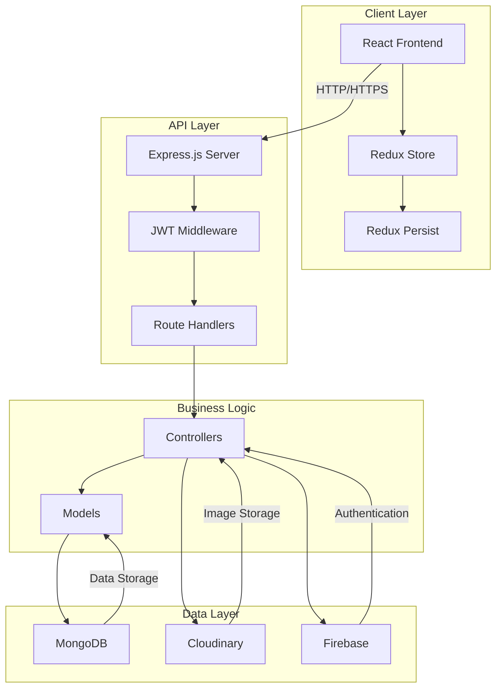
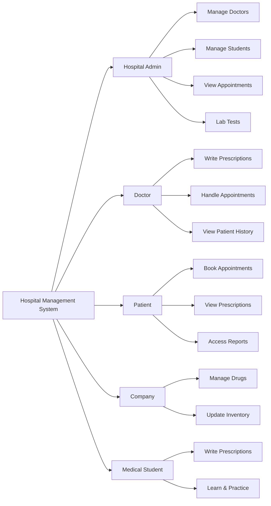
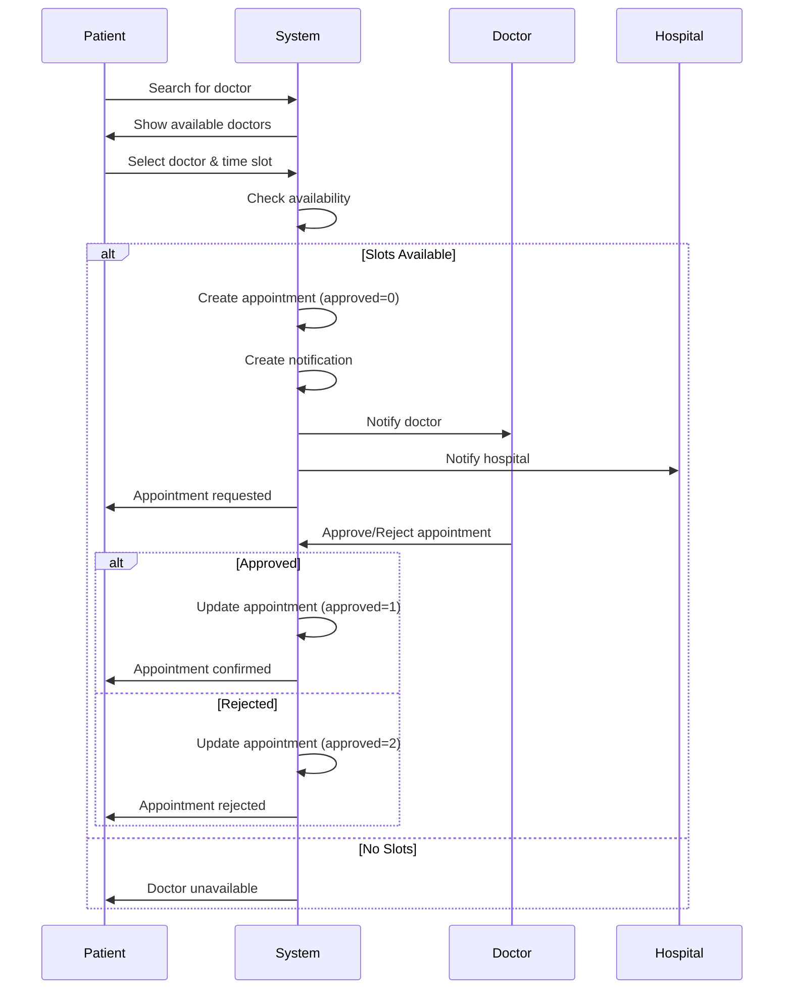
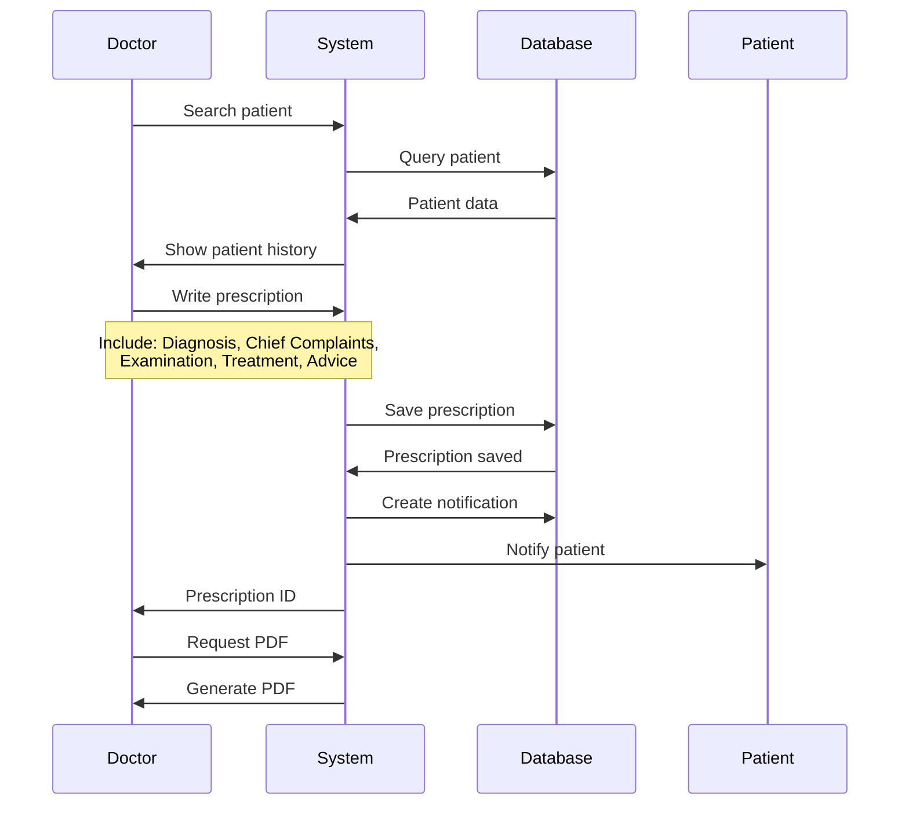
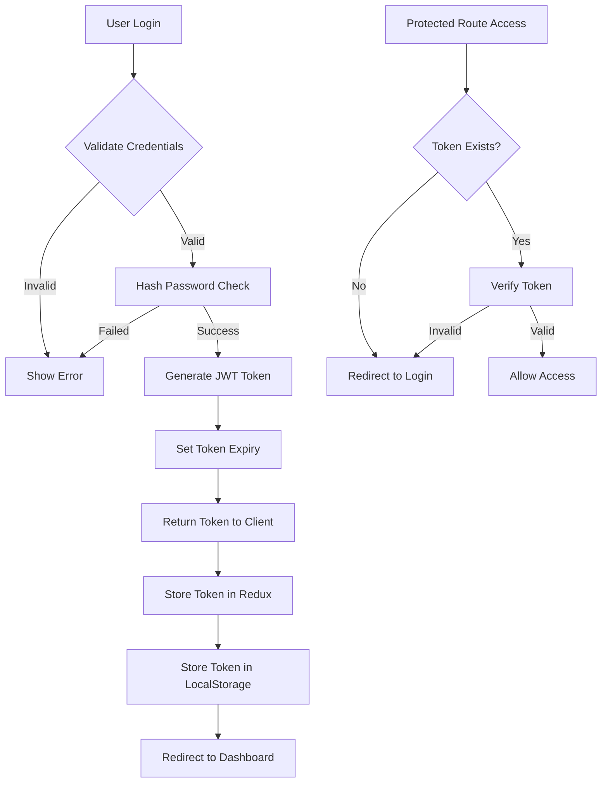
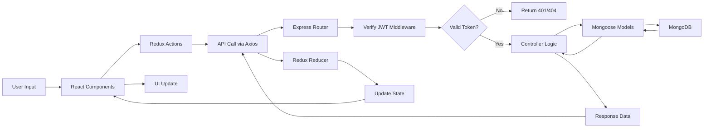

# 🏥 Hospital Management System

A comprehensive full-stack healthcare management platform built with MERN stack (MongoDB, Express.js, React, Node.js) for managing hospitals, doctors, patients, pharmaceutical companies, and medical students.

[](https://nodejs.org/)
[](https://reactjs.org/)
[](https://www.mongodb.com/)
[](LICENSE)

## 🌐 Live Demo

**Live Application**: [https://mediappointcare.onrender.com/](https://mediappointcare.onrender.com/)

### 🔑 Demo Credentials

Try all features with these test accounts:

| Role            | Phone Number | Password |
| --------------- | ------------ | -------- |
| **👨‍⚕️ Doctor**   | 01786312998  | 123123   |
| **🏥 Hospital** | 01786312998  | 123123   |
| **🧑‍⚕️ Patient**  | 01786312998  | 123123   |

> **Note**: These are demo accounts for testing purposes. Feel free to explore all features!

## 📋 Table of Contents

- [Overview](#overview)
- [Features](#features)
- [System Architecture](#system-architecture)
- [User Roles](#user-roles)
- [Technology Stack](#technology-stack)
- [Installation & Setup](#installation--setup)
- [API Documentation](#api-documentation)
- [Database Schema](#database-schema)
- [Workflows & Diagrams](#workflows--diagrams)
- [Project Structure](#project-structure)
- [Environment Variables](#environment-variables)
- [Deployment](#deployment)
- [Contributing](#contributing)
- [License](#license)
- [Author](#author)

## 🎯 Overview

This Hospital Management System is designed to digitize and streamline healthcare operations for hospitals in Bangladesh. It provides a complete Electronic Medical Records (EMR) system with features for appointment scheduling, prescription management, patient records, and multi-role user management.

### Key Highlights

- **Multi-role Support**: Hospitals, Doctors, Patients, Pharmaceutical Companies, and Medical Students
- **Complete EMR**: Digital prescription writing with comprehensive medical examination records
- **Appointment System**: Smart booking system with time slot management
- **Real-time Notifications**: Instant updates for prescriptions and appointments
- **Secure Authentication**: JWT-based authentication with role-based access control
- **Offline Support**: Redux-persist for offline data persistence
- **Print & PDF**: Generate printable prescriptions and reports

## ✨ Features

### 👨‍⚕️ For Doctors

- ✅ Register with BMDC (Bangladesh Medical & Dental Council) number
- ✅ Manage multiple hospital affiliations
- ✅ Write detailed digital prescriptions
- ✅ Handle appointment requests (approve/reject)
- ✅ View patient history and previous prescriptions
- ✅ Set unavailable days and time slots
- ✅ Update profile and consultation notes

### 🏥 For Hospitals

- ✅ Register with DGHS (Directorate General of Health Services) number
- ✅ Manage doctors, staff, and medical students
- ✅ Handle diagnostic test details and pricing
- ✅ Track test reports and lab results
- ✅ Manage ambulance contact numbers
- ✅ View all appointments and prescriptions
- ✅ Notification management

### 🧑‍⚕️ For Patients

- ✅ Register and maintain health profile
- ✅ Search and find doctors by specialization
- ✅ Book appointments with preferred doctors
- ✅ View prescription history
- ✅ Access test reports
- ✅ Receive real-time notifications
- ✅ Track medical records
- ✅ Print/download prescriptions

### 💊 For Pharmaceutical Companies

- ✅ Register company with registration number
- ✅ Manage drug inventory
- ✅ Add and update medicine details
- ✅ Track medicine usage across prescriptions

### 🎓 For Medical Students

- ✅ Affiliated with hospitals for training
- ✅ Write prescriptions under supervision
- ✅ Learn from doctor's prescriptions
- ✅ Access hospital resources

## 🏗️ System Architecture



## 👥 User Roles



## 🛠️ Technology Stack

### Backend

- **Runtime**: Node.js 14.15.1
- **Framework**: Express.js 4.18.0
- **Database**: MongoDB with Mongoose ODM
- **Authentication**: JSON Web Tokens (JWT), Bcrypt
- **File Upload**: Express-fileupload, Multer
- **Cloud Storage**: Cloudinary
- **Validation**: Express-validator
- **Other**: Compression, CORS, CSV parsing

### Frontend

- **Library**: React 16.13.1
- **State Management**: Redux, Redux-Thunk, Redux-Persist
- **Routing**: React Router DOM v5
- **UI Framework**: Material-UI 4.11.0
- **Charts**: Chart.js, React-ChartJS-2, ApexCharts
- **Date Handling**: Date-fns, React-Datepicker
- **HTTP Client**: Axios
- **PDF Generation**: React-to-pdf, React-to-print
- **Testing**: Jest, React Testing Library

### DevOps & Deployment

- **Platform**: Heroku
- **Version Control**: Git
- **Package Manager**: npm

## 📦 Installation & Setup

### Prerequisites

- Node.js (v14.15.1 or higher)
- MongoDB (local or Atlas)
- npm or yarn
- Git

### Clone Repository

```bash
git clone <repository-url>
cd Hospital_Management
```

### Backend Setup

1. **Install dependencies**

```bash
npm install
```

2. **Create `.env` file in root directory**

```env
PORT=8800
DATABASE=mongodb://localhost:27017/hospital_management
# Or for MongoDB Atlas:
# DATABASE=mongodb+srv://<username>:<password>@cluster.mongodb.net/hospital_management

SECRECT_KEY=your_jwt_secret_key_here
NODE_ENV=development

# Cloudinary Configuration (optional)
CLOUDINARY_CLOUD_NAME=your_cloud_name
CLOUDINARY_API_KEY=your_api_key
CLOUDINARY_API_SECRET=your_api_secret

# Firebase Configuration (optional)
FIREBASE_API_KEY=your_firebase_api_key
FIREBASE_AUTH_DOMAIN=your_auth_domain
FIREBASE_PROJECT_ID=your_project_id
```

3. **Start backend server**

```bash
npm start
```

Backend will run on `http://localhost:8800`

### Frontend Setup

1. **Navigate to client directory**

```bash
cd client
```

2. **Install dependencies**

```bash
npm install
```

3. **Configure API endpoint** (if needed)
   Update `client/src/Route.js`:

```javascript
export const route = "http://localhost:8800/";
```

4. **Start frontend development server**

```bash
npm start
```

Frontend will run on `http://localhost:3000`

### Full Stack Development

For development, run both servers:

**Terminal 1 (Backend):**

```bash
npm start
```

**Terminal 2 (Frontend):**

```bash
cd client
npm start
```

## 📚 API Documentation

### Base URL

```
http://localhost:8800/api
```

### Authentication

All protected routes require JWT token in header:

```
Authorization: Bearer <token>
```

### API Endpoints

#### 🔐 Authentication

| Method | Endpoint          | Description           | Auth Required |
| ------ | ----------------- | --------------------- | ------------- |
| POST   | `/api/auth/token` | Verify token validity | ✅            |

#### 🏥 Hospital Routes

| Method | Endpoint                        | Description              | Auth Required |
| ------ | ------------------------------- | ------------------------ | ------------- |
| POST   | `/api/hospital/registration`    | Register new hospital    | ❌            |
| POST   | `/api/hospital/signin`          | Hospital login           | ❌            |
| POST   | `/api/hospital/recoverAccount`  | Recover account          | ❌            |
| POST   | `/api/hospital/changePassword`  | Change password          | ❌            |
| GET    | `/api/hospital/fetchAllDoctors` | Get all hospital doctors | ✅            |
| GET    | `/api/hospital/fetchAllPatient` | Get all patients         | ✅            |
| DELETE | `/api/hospital/deleteDoctor`    | Remove doctor            | ✅            |

#### 👨‍⚕️ Doctor Routes

| Method | Endpoint                                  | Description                     | Auth Required |
| ------ | ----------------------------------------- | ------------------------------- | ------------- |
| POST   | `/api/doctor/registration`                | Register new doctor             | ✅            |
| POST   | `/api/doctor/addDoctorToHospital`         | Add existing doctor to hospital | ✅            |
| POST   | `/api/doctor/signin`                      | Doctor login                    | ❌            |
| POST   | `/api/doctor/recoverAccount`              | Recover account                 | ❌            |
| POST   | `/api/doctor/changePassword`              | Change password                 | ❌            |
| GET    | `/api/doctor/landingPageDoctor`           | Get doctor list for landing     | ❌            |
| GET    | `/api/doctor/doctorsinfo`                 | Get doctor details              | ✅            |
| POST   | `/api/doctor/updateDoctorHospitalProfile` | Update hospital profile         | ✅            |
| POST   | `/api/doctor/prescriptionNote`            | Update prescription note        | ✅            |
| POST   | `/api/doctor/updateDoctorProfileInfo`     | Update profile info             | ✅            |
| POST   | `/api/doctor/doctorHospitalData`          | Get hospital data               | ✅            |

#### 🧑‍⚕️ Patient Routes

| Method | Endpoint                                       | Description                | Auth Required |
| ------ | ---------------------------------------------- | -------------------------- | ------------- |
| POST   | `/api/patient/registration`                    | Register new patient       | ❌            |
| POST   | `/api/patient/checkUser`                       | Check if user exists       | ❌            |
| POST   | `/api/patient/signin`                          | Patient login              | ❌            |
| POST   | `/api/patient/recoverAccount`                  | Recover account            | ❌            |
| POST   | `/api/patient/changePassword`                  | Change password            | ❌            |
| GET    | `/api/patient/searchPatient`                   | Search patients            | ✅            |
| POST   | `/api/patient/presentation`                    | Create prescription        | ✅            |
| POST   | `/api/patient/editPresentation`                | Edit prescription          | ✅            |
| GET    | `/api/patient/patient_prescription_Data`       | Get prescriptions          | ✅            |
| POST   | `/api/patient/updatePatientDetails`            | Update patient info        | ✅            |
| POST   | `/api/patient/updatePatientPrescriptionReview` | Update prescription review | ✅            |

#### 📅 Appointment Routes

| Method | Endpoint                                    | Description                | Auth Required |
| ------ | ------------------------------------------- | -------------------------- | ------------- |
| POST   | `/api/appointment/request_appointment`      | Request appointment        | ✅            |
| GET    | `/api/appointment/estimated_time`           | Get estimated waiting time | ✅            |
| POST   | `/api/appointment/doctors_appointment_list` | Get doctor's appointments  | ✅            |
| PUT    | `/api/appointment/approve_Appointment`      | Approve appointment        | ✅            |
| PUT    | `/api/appointment/reject_Appointment`       | Reject appointment         | ✅            |
| DELETE | `/api/appointment/delete_Appointment`       | Delete appointment         | ✅            |

#### 💊 Company Routes

| Method | Endpoint                           | Description           | Auth Required |
| ------ | ---------------------------------- | --------------------- | ------------- |
| POST   | `/api/company/registration`        | Register company      | ❌            |
| POST   | `/api/company/signin`              | Company login         | ❌            |
| POST   | `/api/company/addDrug`             | Add new drug          | ✅            |
| POST   | `/api/company/updateDrug`          | Update drug info      | ✅            |
| GET    | `/api/company/companyMedicineName` | Get company medicines | ✅            |

#### 📋 Prescription Routes

| Method | Endpoint                                 | Description               | Auth Required |
| ------ | ---------------------------------------- | ------------------------- | ------------- |
| POST   | `/api/prescription/write`                | Write prescription        | ✅            |
| GET    | `/api/prescription/patient/:patientId`   | Get patient prescriptions | ✅            |
| PUT    | `/api/prescription/edit/:prescriptionId` | Edit prescription         | ✅            |
| GET    | `/api/prescription/:prescriptionId`      | Get single prescription   | ✅            |

#### 🔔 Notification Routes

| Method | Endpoint                     | Description           | Auth Required |
| ------ | ---------------------------- | --------------------- | ------------- |
| GET    | `/api/notification/list`     | Get all notifications | ✅            |
| PUT    | `/api/notification/markRead` | Mark as read          | ✅            |

#### 📊 Dashboard Routes

| Method | Endpoint               | Description              | Auth Required |
| ------ | ---------------------- | ------------------------ | ------------- |
| GET    | `/api/dashboard/stats` | Get dashboard statistics | ✅            |

#### 📁 File Upload Routes

| Method | Endpoint           | Description   | Auth Required |
| ------ | ------------------ | ------------- | ------------- |
| POST   | `/api/file/avatar` | Upload avatar | ✅            |

## 🗄️ Database Schema

### User Models

#### Hospital Schema

```javascript
{
  hc_hospital_bangla_name: String (required),
  hc_hospital_english_name: String (required),
  hc_hospital_email: String (unique, required),
  hc_hospital_phoneno: String (unique, required),
  hc_hospital_hashpassword: String (required),
  hc_hospital_address: {
    upazila: String,
    district: String
  },
  hc_hospital_logo: String,
  hc_hospital_DGHS_reg_no: String (unique),
  hc_hospital_notifications: [{ notificationID: ObjectId }],
  hc_hospital_diagnosis_test_details: [{
    diagnosis_name: String,
    diagnosis_price: Number
  }],
  hc_med_student: [ObjectId],
  timestamps: true
}
```

#### Doctor Schema

```javascript
{
  hc_doctor_banglaName: String (required),
  hc_doctor_englishName: String (required),
  hc_doctor_email: String (unique, required),
  hc_doctor_phoneno: String (unique, required),
  hc_doctor_NID: Number (unique),
  hc_doctor_sex: String (enum: ["Male", "Female"]),
  hc_doctor_avatar: String,
  hc_doctor_bloodGroup: String,
  hc_doctor_date_of_birth: String (required),
  hc_doctor_BMDC_reg_no: String (unique, required),
  hc_doctor_specialist: String,
  hc_doctor_education: String,
  hc_doctor_consultant: String,
  hc_doctor_of_hospital: [{
    hospitalID: ObjectId,
    notAvailableDays: Array
  }],
  hc_doctor_write_prescription: [{
    prescriptionID: ObjectId,
    Note: String
  }],
  timestamps: true
}
```

#### Patient Schema

```javascript
{
  hc_patient_firstName: String (required),
  hc_patient_lastName: String,
  hc_patient_bloodGroup: String,
  hc_patient_occupation: String,
  hc_patient_phoneno: String (unique),
  hc_patient_sex: String (enum: ["Male", "Female"]),
  hc_patient_avatar: String,
  hc_patient_date_of_birth: String,
  hc_patient_hashpassword: String (required),
  hc_patient_address: {
    upazila: String,
    district: String
  },
  hc_patient_marital_status: String (enum: ["Married", "Unmarried"]),
  hc_patient_prescription: [{ prescriptionID: ObjectId }],
  hc_patient_notifications: [{ notificationID: ObjectId }],
  hc_patient_testReport: [{ testReport: ObjectId }],
  timestamps: true
}
```

### Clinical Models

#### Prescription Schema

```javascript
{
  Diagnosis: [{ diagonosis: String }],
  cheif_complain: [{ complains: String }],
  teratment: [{
    med_type: String,
    med_name: String,
    med_dose_in_a_day: String,
    med_dose_days: String,
    med_dose_meal: String,
    med_important: Boolean
  }],
  follow_up: String,
  advice: [String],
  hc_p_cheif_past_history: [{
    history: String,
    case: String
  }],
  hc_p_cheif_drug_history: [String],
  hc_p_general_examination: {
    Anemia: String,
    Jaundice: String,
    Oedema: String,
    Pulse: String,
    Blood_pressure: String,
    Respiration: String,
    Body_temperature: String
  },
  hc_p_gex_systemic_examination: {
    CVS: String,
    Respiratory_system: String,
    GIT: String,
    Nervous_system: String
  },
  patientId: ObjectId (ref: Patient),
  doctorId: ObjectId (ref: Doctor),
  chamber: Object,
  timestamps: true
}
```

#### Appointment Schema

```javascript
{
  hc_appoinmentDate: String (required),
  hc_doctorId: ObjectId (ref: Doctor, required),
  hc_hospitalID: ObjectId (ref: Hospital, required),
  hc_appointment_patient: ObjectId (ref: Patient, required),
  visitingSlot: Number (enum: [1, 2], required),
  approved: Number (enum: [0, 1, 2], default: 0),
  hasVisit: Boolean (default: false),
  serialNo: Number
}
```

#### Notification Schema

```javascript
{
  prescriptionID: ObjectId (ref: Prescription),
  appointmentID: ObjectId (ref: Appointment),
  doctorID: ObjectId (ref: Doctor),
  patientID: ObjectId (ref: Patient),
  hospitalID: ObjectId (ref: Hospital),
  type: String (enum: ["P", "A"]), // P=Prescription, A=Appointment
  isChecked: Boolean (default: false),
  timestamps: true
}
```

## 📊 Workflows & Diagrams

### Appointment Booking Flow



### Prescription Writing Flow



### User Authentication Flow



### System Data Flow



## 📁 Project Structure

```
Hospital_Management/
├── client/                          # Frontend React Application
│   ├── public/
│   │   ├── index.html
│   │   ├── manifest.json
│   │   └── robots.txt
│   ├── src/
│   │   ├── components/              # React Components
│   │   │   ├── Dashboard/           # Dashboard views
│   │   │   ├── Login/               # Authentication
│   │   │   ├── Prescription/        # Prescription management
│   │   │   ├── Profile/             # User profiles
│   │   │   ├── Doctors/             # Doctor management
│   │   │   ├── Patients/            # Patient management
│   │   │   ├── AppoinmentHandle/    # Appointment handling
│   │   │   ├── PatientDashboard/    # Patient portal
│   │   │   ├── AddLabTest/          # Lab tests
│   │   │   └── ...                  # Other components
│   │   ├── redux/                   # State Management
│   │   │   ├── store.js
│   │   │   ├── rootreducer.js
│   │   │   └── reducers/
│   │   ├── actions/                 # Redux actions
│   │   ├── Service/                 # API services
│   │   ├── Images/                  # Static images
│   │   ├── assest/                  # Assets
│   │   ├── App.js                   # Main App component
│   │   ├── Route.js                 # API route config
│   │   └── index.js                 # Entry point
│   └── package.json
├── src/                             # Backend Node.js Application
│   ├── Controlers/                  # Business Logic
│   │   ├── doctor_auth_controller/
│   │   ├── patient_auth_controller/
│   │   ├── hospital_auth_controller/
│   │   ├── company_Controller/
│   │   ├── prescription_controller/
│   │   ├── appointment_controller/
│   │   ├── notification_controller/
│   │   ├── dashboard_controller/
│   │   └── ...
│   ├── models/                      # Mongoose Schemas
│   │   ├── doctor_model/
│   │   ├── patient_model/
│   │   ├── hospital_model/
│   │   ├── prescription_model/
│   │   ├── Appoinment_model/
│   │   ├── Notification_model/
│   │   ├── Drug_model/
│   │   └── ...
│   ├── routers/                     # Express Routes
│   │   ├── users_routers/
│   │   ├── appointment/
│   │   ├── prescription_route/
│   │   ├── notification_router/
│   │   ├── dashboard/
│   │   └── ...
│   ├── middileware/                 # Middleware
│   │   └── verifyToken.js          # JWT verification
│   └── db/                          # Database Config
│       └── connectMongoose.js
├── app.js                           # Express App Entry
├── package.json                     # Backend dependencies
├── .env                             # Environment variables
└── README.md                        # This file
```

## 🌍 Environment Variables

Create a `.env` file in the root directory:

```env
# Server Configuration
PORT=8800
NODE_ENV=development

# Database
DATABASE=mongodb://localhost:27017/hospital_management
# Or MongoDB Atlas:
# DATABASE=mongodb+srv://<username>:<password>@cluster.mongodb.net/hospital_management?retryWrites=true&w=majority

# JWT Secret
SECRECT_KEY=your_super_secret_jwt_key_here_make_it_complex

# Cloudinary (Optional - for image uploads)
CLOUDINARY_CLOUD_NAME=your_cloud_name
CLOUDINARY_API_KEY=your_cloudinary_api_key
CLOUDINARY_API_SECRET=your_cloudinary_api_secret

# Firebase (Optional - for additional auth)
FIREBASE_API_KEY=your_firebase_api_key
FIREBASE_AUTH_DOMAIN=your_project.firebaseapp.com
FIREBASE_PROJECT_ID=your_project_id
FIREBASE_STORAGE_BUCKET=your_project.appspot.com
FIREBASE_MESSAGING_SENDER_ID=your_sender_id
FIREBASE_APP_ID=your_app_id

# Email Configuration (Optional - for notifications)
EMAIL_SERVICE=gmail
EMAIL_USER=your_email@gmail.com
EMAIL_PASSWORD=your_app_password
```

## 🚀 Deployment

### Heroku Deployment

The project is configured for Heroku deployment with automatic build process.

1. **Create Heroku App**

```bash
heroku create your-app-name
```

2. **Set Environment Variables**

```bash
heroku config:set DATABASE=your_mongodb_uri
heroku config:set SECRECT_KEY=your_secret_key
heroku config:set NODE_ENV=production
```

3. **Deploy**

```bash
git push heroku main
```

4. **Open Application**

```bash
heroku open
```

### Production Build

The `heroku-postbuild` script automatically:

1. Installs client dependencies
2. Builds React production bundle
3. Serves static files from Express

```json
"heroku-postbuild": "NPM_CONFIG_PRODUCTION=false npm install --prefix client && npm run build --prefix client"
```

### Manual Production Build

```bash
# Build frontend
cd client
npm run build

# Start backend (serves frontend from build folder)
cd ..
npm start
```

## 🧪 Testing

```bash
# Frontend tests
cd client
npm test

# Run tests in watch mode
npm test -- --watch

# Generate coverage report
npm test -- --coverage
```

## 🔒 Security Features

- **Password Hashing**: Bcrypt with 12 salt rounds
- **JWT Authentication**: Secure token-based auth
- **CORS Protection**: Configured CORS policies
- **Input Validation**: Express-validator for request validation
- **Role-Based Access**: Middleware for role verification
- **Environment Variables**: Sensitive data in .env
- **HTTPS Ready**: Production-ready SSL configuration

## 🎨 UI Features

- **Responsive Design**: Mobile-friendly interface
- **Material-UI**: Modern, professional design
- **Dark/Light Mode**: Theme support (if implemented)
- **Charts & Graphs**: Visual data representation
- **Print Support**: Print prescriptions and reports
- **PDF Generation**: Download documents
- **Real-time Updates**: Instant notifications
- **Offline Support**: Redux-persist for offline functionality

## 📱 Supported Browsers

- ✅ Chrome (recommended)
- ✅ Firefox
- ✅ Safari
- ✅ Edge
- ⚠️ IE11 (limited support)

## 🐛 Known Issues & Limitations

1. Route.js contains commented-out backend URLs - uncomment appropriate one
2. Some component imports in sideNavBar.jsx are unused
3. Medical examination fields use Bengali language options
4. Email notification feature not fully implemented
5. Cluster mode commented out in app.js

## 🔄 Future Enhancements

- [ ] Video consultation integration
- [ ] SMS/Email notifications
- [ ] Advanced analytics dashboard
- [ ] Insurance claim management
- [ ] Pharmacy integration
- [ ] Telemedicine features
- [ ] Mobile app (React Native)
- [ ] AI-based diagnosis suggestions
- [ ] Multi-language support
- [ ] Payment gateway integration

## 🤝 Contributing

Contributions are welcome! Please follow these steps:

1. Fork the repository
2. Create a feature branch (`git checkout -b feature/AmazingFeature`)
3. Commit your changes (`git commit -m 'Add some AmazingFeature'`)
4. Push to the branch (`git push origin feature/AmazingFeature`)
5. Open a Pull Request

### Coding Standards

- Follow ESLint configuration
- Use meaningful variable names
- Write comments for complex logic
- Keep components small and focused
- Follow REST API conventions

## 📄 License

This project is licensed under the ISC License.

## 👨‍💻 Author

**Rownok Jahan Nishat**

- Project: Health Care Backend
- Version: 1.0.0

## 🙏 Acknowledgments

- Material-UI for the component library
- MongoDB for the database
- Express.js community
- React community
- All open-source contributors

## 📞 Support

For support and queries:

- Create an issue in the repository
- Contact the development team

## 📚 Additional Resources

- [Express.js Documentation](https://expressjs.com/)
- [React Documentation](https://reactjs.org/)
- [MongoDB Documentation](https://docs.mongodb.com/)
- [Material-UI Documentation](https://material-ui.com/)
- [Redux Documentation](https://redux.js.org/)

---

**Note**: This is a medical management system. Ensure compliance with healthcare data regulations (HIPAA, GDPR, etc.) before deploying in production environments.

Made with ❤️ for better healthcare management
